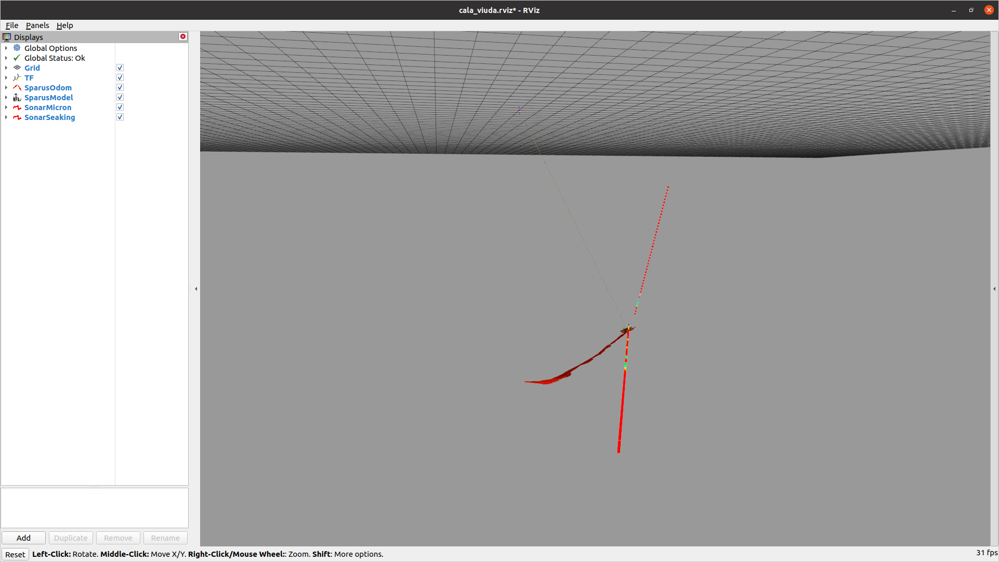

# UW_SLAM
This is a final research project for NA 568/EECS 568/ROB 530 MOBILE ROBOTICS: METHODS & ALGORITHMS WINTER 2022 at the University of Michigan. The goal of this project is to utilize Graph Based SLAM for the dataset of an autonomous underwater vehicle navigating system of underwater cave. We have formulated the Graph SLAM problem using the GTSAM library with sensor measurements of DVL, depth and IMU as factors. Additionally, 6 traffic cones were used as ground truth to validate our results against the existing trajectory optimization methods.

## Setting up ROS
- If you have Ubuntu 20.04 or Debian Buster, you can install ROS by following the link:
http://wiki.ros.org/noetic/Installation/
- If you have Ubuntu 18.04 or Debian Buster, you can install ROS by following the link: http://wiki.ros.org/melodic/Installation

## Cloning this directory
- This directory can be treated as the `catkin_ws` directory that are explained in most ROS tutorials. Simply run the following command in a directory that is not the `catkin_ws` directory:
```
git clone git@github.com:onurbagoren/UW_SLAM.git
```
- Run the following commands to compile the ROS packages:
```
cd UW_SLAM
catkin_make
source devel/setup.bash
```

## Visualizing the data
- Initally, make sure that you create a data directory in the `src/cirs_girona_cala_ciuda` file by running the following command: `mkdir -p src/cirs_girona_cala_ciuda/data`
- Then, move the data in https://drive.google.com/drive/folders/1lM9ZxQg0g3F8UxILcddMr8hU6OcUg3Hb to the `src/cirs_girona_cala_ciuda/data` directory.
- Then, run the following command to visualize the data:
```
roslaunch cirs_girona_cala_ciuda play_data.launch
```
- This should launch an RViz window that shows the robot, the robots odometry over time, and the sonar readings over time, as shown in the image below.


## Relevant Notes
- In the `src/cirs_girona_cala_ciuda/launch/play_data.launch` file, you can find notes regarding which line to comment of uncomment, depending on your ROS distribution. This is not a major issue, as the visualization will work - but will get rid of the error message that may appear when launching the file.

## Relevant Papers
- Please make sure to read the following papers:
    - https://link.springer.com/content/pdf/10.1007/s10514-013-9345-0.pdf
    - https://journals.sagepub.com/doi/pdf/10.1177/0278364917732838
    - https://onlinelibrary.wiley.com/doi/epdf/10.1002/rob.21640
    - https://github.com/sansaldo/IEKF_AUV_Cave_Navigation
    
## Plotting Sonar data
Keep in mind that this visualization is of a 360 degree scan, which takes ~5-20 seconds to complete, per the spec sheet of the sonar on the robot.
```
cd src/circ_girona_cala_viuda/scripts
python3 visualize_sonar.py
```

