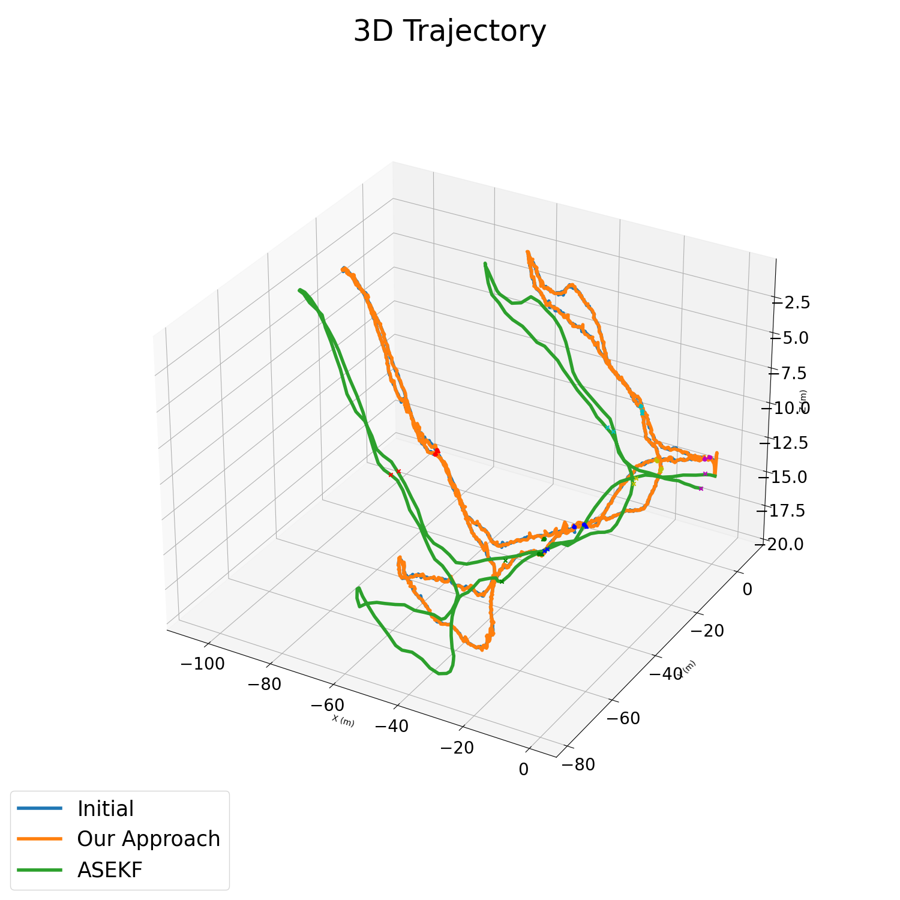
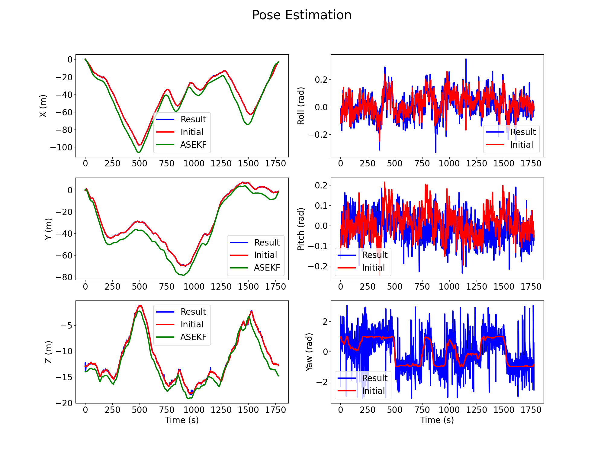

# Underwater SLAM
This is a final research project for NA 568/EECS 568/ROB 530 MOBILE ROBOTICS: METHODS & ALGORITHMS WINTER 2022 at the University of Michigan. The goal of this project is to utilize Graph Based SLAM for the dataset of an autonomous underwater vehicle navigating system in underwater cave. We have formulated the Graph SLAM problem using the GTSAM library with sensor measurements of DVL, depth and IMU as factors. Additionally, 6 traffic cones were used as ground truth to validate our results against the existing trajectory optimization methods.

The presentation for this work can be found on this YouTube video: https://youtu.be/MtZ0FqfiBDI

#### Group Members:
- Onur Bagoren: https://github.com/onurbagoren
- Rastri Dey: https://github.com/rastri-dey
- Zhen Zhong: https://github.com/Tigerzhong212
- Zihan Zhou: https://github.com/baobaotang0
- Zhongru Liang: https://github.com/2034492239

**Although the contributors appear as two people, all members contributed to the code.**

## Installations
### Cloning this directory
- This directory can be treated as the `catkin_ws` directory that are explained in most ROS tutorials. Simply run the following command in a directory that is not the `catkin_ws` directory:
```
git clone git@github.com:onurbagoren/UW_SLAM.git
```

### Required Packages
The Required packages are as follows:
- gtsam
- numpy
- matplotlib
- tqdm
- csv
- scipy
- pandas

These can be installed by running the following command: `pip install -r requirements.txt`

### Running Graph SLAM for the given dataset
- In order to run the scripts, run the following commands:
```
cd scripts/front_end
python3 front_end.py
```

- Run the following commands to compile the ROS packages that will help visualize the robot in RViz 
    - (DISCLAIMER: The visualization scripts were provided by the original dataset. This is not part of the project, but more of a visualization for the viewers. The dataset and scripts can be found at: https://cirs.udg.edu/caves-dataset/):
```
cd UW_SLAM
catkin_make
source devel/setup.bash
```

## Result
### 3D Plot of the Trajectory Compared to Previous Methods

### Plot of the individual components of the pose of the robot, compared to previous methods



## Visualization with RViz (Complemnentary to project material, not part of the work that was done for the project)

### Setting up ROS
- If you have Ubuntu 20.04 or Debian Buster, you can install ROS by following the link:
http://wiki.ros.org/noetic/Installation/
- If you have Ubuntu 18.04 or Debian Buster, you can install ROS by following the link: http://wiki.ros.org/melodic/Installation


### Visualizing the data
- Initally, make sure that you create a data directory in the `src/cirs_girona_cala_ciuda` file by running the following command: `mkdir -p src/cirs_girona_cala_ciuda/data`
- Then, move the data in https://drive.google.com/drive/folders/1lM9ZxQg0g3F8UxILcddMr8hU6OcUg3Hb to the `src/cirs_girona_cala_ciuda/data` directory.
- Then, run the following command to visualize the data:
```
roslaunch cirs_girona_cala_ciuda play_data.launch
```

## Relevant Papers and Work
- Please make sure to read the following papers:
    - https://link.springer.com/content/pdf/10.1007/s10514-013-9345-0.pdf
    - https://journals.sagepub.com/doi/pdf/10.1177/0278364917732838
    - https://onlinelibrary.wiley.com/doi/epdf/10.1002/rob.21640

- The original work for the IEKF trajectory estimation was completed by the following team. Outputs from their work and validation scripts were used from the following repository:
    - https://github.com/sansaldo/IEKF_AUV_Cave_Navigation

- The original dataset can be found from: https://cirs.udg.edu/caves-dataset/

## Acknowledgement
Professor Maani Ghaffari and the instruction team of ROB 530 in Winter 2022.


